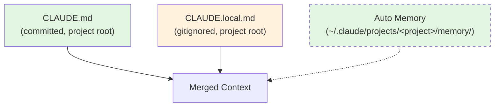

# DevOS: A Structured Operating System for Claude Code

---

## 1. Architecture Principles

### 1.1 Core Design Philosophy

DevOS treats Claude Code configuration as a layered operating system. Each layer has a specific role, a defined scope, and clear boundaries. The system is designed so that:

- **CLAUDE.md** defines project identity and principles — the "constitution"
- **Rules** encode standards that apply automatically based on file context — the "laws"
- **Skills** define repeatable workflows Claude follows on invocation — the "playbooks"
- **Hooks** enforce invariants through shell scripts that run at tool boundaries — the "guardrails"
- **Agents** define specialized subagent roles with scoped capabilities — the "specialists"
- **Knowledge** provides reference documentation Claude reads on demand — the "library"

Each component type has a single responsibility. Rules do not contain workflow steps. Skills do not contain coding standards. Hooks do not contain domain knowledge. This separation ensures each file is loaded only when relevant, minimizing context waste.

**Key mechanisms:**
- Use `globs:` frontmatter on rules to load them conditionally based on which files Claude is working with
- Use `description:` frontmatter on skills so Claude can match natural language requests to the right workflow
- Use hook exit codes to control whether operations are blocked (exit 2), allowed (exit 0), or degraded on error (exit 1)

**Template defaults:** This template uses Node.js/TypeScript for all example commands, permissions, and code style rules. Projects using other languages or frameworks must adapt these defaults — see Section 7.2 for guidance.

### 1.2 Layered Architecture Diagram

```
┌─────────────────────────────────────────────────────┐
│                    CLAUDE.md                         │
│         Project identity, tech stack, principles     │
│              Always loaded. ~500 tokens.             │
├─────────────────────────────────────────────────────┤
│                      Rules                           │
│     Code standards, conventions, git workflow        │
│  Unconditional (always) or conditional (via globs:)  │
├─────────────────────────────────────────────────────┤
│                     Skills                           │
│      Spec, plan, review, commit, catchup, validate   │
│  Descriptions indexed at startup; full content on    │
│  invocation only                                     │
├─────────────────────────────────────────────────────┤
│                      Hooks                           │
│     File protection, edit reminders, verification    │
│        Shell scripts at tool-use boundaries          │
├─────────────────────────────────────────────────────┤
│                     Agents                           │
│        Code reviewer, verifier, planner (subagents)  │
│    Scoped roles with instructional tool lists        │
├─────────────────────────────────────────────────────┤
│                    Knowledge                         │
│    Architecture, design decisions, domain glossary   │
│         Read on demand via natural language          │
└─────────────────────────────────────────────────────┘
```

### 1.3 Component Reference Table

| Component         | Location                                        | When Loaded                                                  | Purpose                                                      |
| ----------------- | ----------------------------------------------- | ------------------------------------------------------------ | ------------------------------------------------------------ |
| `CLAUDE.md`       | Project root                                    | Always — full content loaded at session start                | Project identity, stack, principles, key commands            |
| `CLAUDE.local.md` | Project root (gitignored)                       | Always — merged with CLAUDE.md                               | Personal preferences, local environment details              |
| Rules             | `.claude/rules/*.md`                            | Always (no `globs:`) or conditionally (`globs:` matches active files) | Coding standards, naming conventions, workflow rules         |
| Skills            | `.claude/skills/*/SKILL.md`                     | Descriptions indexed at session start for matching; full content loaded only when invoked | Repeatable workflows: spec, plan, review, commit             |
| Hooks             | `.claude/hooks/*.sh`                            | Automatically at tool-use boundaries (PreToolUse, PostToolUse, Stop) | Invariant enforcement: file protection, reminders, verification |
| Agents            | `.claude/agents/*.md`                           | When spawned as subagents                                    | Scoped specialist roles: reviewer, verifier, planner         |
| Knowledge         | `.claude/knowledge/*.md`                        | On demand — Claude reads when instructed or when contextually relevant | Architecture reference, design decisions, domain glossary    |
| Settings          | `.claude/settings.json`                         | Always — parsed at session start                             | Hook registration, tool permissions                          |
| Settings (local)  | `.claude/settings.local.json` (gitignored)      | Always — merged with settings.json                           | Personal hook/permission overrides                           |
| Auto memory       | `~/.claude/projects/<project>/memory/MEMORY.md` | Always — first 200 lines loaded at session start             | Auto-generated session-to-session notes, patterns, preferences |

**Important distinctions:**

- **`globs:` controls automatic loading, not access.** A rule with `globs: "src/**/*.ts"` is automatically loaded when Claude edits TypeScript files in `src/`. However, Claude can always read any rule file manually when explicitly instructed — `globs:` does not restrict file access.

- **File references are natural language instructions.** When CLAUDE.md says "Read `.claude/knowledge/architecture.md` for system design reference," this is a natural language instruction that Claude interprets and follows. There is no special import or include syntax — Claude reads the referenced file when it determines the context is relevant.

- **Skill descriptions are metadata, not context.** Skill `description:` fields are indexed at session start so Claude can match natural language requests (e.g., "review my code") to the correct skill (e.g., `/code-review`). The full SKILL.md content is loaded into context only when the skill is actually invoked. This is distinct from CLAUDE.md, which is loaded as active context at session start.

### 1.4 Context Budget

| Layer                       | Budget               | Rationale                                                  |
| --------------------------- | -------------------- | ---------------------------------------------------------- |
| CLAUDE.md + CLAUDE.local.md | ~500 tokens combined | Loaded every session — keep dense and factual              |
| Each rule file              | ~200–400 tokens      | Loaded automatically — must justify every line             |
| Each skill (full content)   | ~300–800 tokens      | Loaded only on invocation — can be more detailed           |
| Each knowledge file         | ~500–2000 tokens     | Read on demand — size constrained only by usefulness       |
| Each hook script            | 0 tokens (external)  | Hooks run as shell processes — they do not consume context |

**Guideline:** If CLAUDE.md exceeds ~600 tokens, move detail into rules or knowledge files. CLAUDE.md should contain only what Claude needs in every single interaction.

---

## 2. Component Deep Dives

### 2.1 CLAUDE.md and CLAUDE.local.md



*Dashed border indicates auto-generated content managed by Claude's auto memory system, stored outside the project directory.*

**CLAUDE.md** is the project constitution. It contains:
- Project identity (one line: what this is)
- Tech stack (languages, frameworks, databases, test tools)
- Key commands (test, lint, typecheck, dev server)
- Core principles (3–6 rules that override everything else)
- Pointers to knowledge files for deeper context

**CLAUDE.local.md** is personal and gitignored. It contains:
- Communication preferences (verbosity, language, format)
- Local environment details (OS, package manager, editor)
- Personal workflow preferences

**Auto memory** is managed by Claude's auto memory system. Claude writes session notes to `~/.claude/projects/<project>/memory/MEMORY.md` and optional topic files in the same directory. The first 200 lines of MEMORY.md are loaded at the start of every session. This directory is outside the project tree and is not version-controlled. Use `/memory` to browse, edit, or toggle auto memory. Periodically review saved notes and promote stable patterns into rules or knowledge files.

### 2.2 Rules

Rules are coding standards, conventions, and constraints that Claude follows automatically.

**Frontmatter fields:**
- `description:` — Human-readable summary of what the rule covers
- `globs:` — File path pattern(s) controlling when the rule is auto-loaded

**Loading behavior:**
- Rules without `globs:` are unconditional — loaded in every session
- Rules with `globs:` are conditional — loaded only when Claude works with files matching the pattern
- Multiple globs are supported: `globs: "src/**/*.ts, src/**/*.tsx"`
- Claude can always read any rule file manually regardless of `globs:` scope

**Design guidelines:**
- Each rule file covers one topic (code style, git workflow, testing conventions)
- Rules are declarative ("do X") not procedural ("step 1, step 2")
- Rules do not contain workflow steps — those belong in skills

### 2.3 Skills

Skills are repeatable workflows that Claude follows step by step when invoked.

**Invocation:**
1. **Direct invocation:** Type `/skill-name` in the Claude Code prompt (e.g., `/spec-feature`)
2. **Automatic invocation:** Claude matches natural language requests to skill descriptions (e.g., "write a spec for the auth feature" matches the `spec-feature` skill)

**Frontmatter fields:**
- `description:` — Used for matching natural language requests to skills. Keep it clear and specific.

**Design guidelines:**
- Each skill defines a complete workflow with numbered steps
- Skills reference rules and knowledge files by path when they need standards or context
- Skills are procedural ("Step 1: do X. Step 2: do Y") — the inverse of rules
- Skills should specify what outputs they produce (files, commits, reports)

### 2.4 Agents

Agents are specialized subagent configurations spawned via `Task` tool calls. Each agent markdown file defines a role, its intended capabilities, and its constraints.

**Frontmatter fields:**
- `description:` — What the agent specializes in
- `tools:` — List of tools the agent should use
- `model:` — Model to use for this agent (e.g., `claude-sonnet-4-20250514` for fast exploration)

**Important:** The `tools:` and `model:` frontmatter fields serve as instructional context — Claude reads them and self-restricts accordingly. They are not enforced at the system level by Claude Code. For hard tool restrictions that cannot be overridden, use `permissions.deny` in `settings.json`.

**Design guidelines:**
- Agents should have a clear, narrow scope (reviewer, explorer, not "general assistant")
- Read-only agents should explicitly state they cannot modify files
- Agent descriptions should indicate when to use this agent vs. the main session

### 2.5 Hooks

Hooks are shell scripts that run automatically at tool-use boundaries. They execute outside Claude's context — they do not consume tokens and Claude does not see the script source code.

**Hook events:**

| Event          | When it Fires            | Input (stdin JSON)                       | Communication Mechanism                                      |
| -------------- | ------------------------ | ---------------------------------------- | ------------------------------------------------------------ |
| `PreToolUse`   | Before a tool executes   | `tool_name`, `tool_input`                | Exit 0: allow. Exit 2: block (stderr sent to Claude).        |
| `PostToolUse`  | After a tool executes    | `tool_name`, `tool_input`, `tool_output` | Exit 0: stdout only in verbose mode. JSON `{"decision":"block","reason":"..."}`: prompts Claude with reason text (does not undo the tool call). Exit 2: stderr shown to Claude. |
| `Stop`         | When Claude finishes     | `stop_hook_active`, `transcript_path`    | Exit 0: allow stop (stdout only in verbose mode). JSON `{"decision":"block","reason":"..."}`: Claude receives `reason` and continues. |
| `SubagentStop` | When a subagent finishes | `stop_hook_active`, `transcript_path`    | Same as Stop.                                                |

**Common input fields (all hooks):** `session_id`, `transcript_path`, `cwd`, `permission_mode`, `hook_event_name`. The `transcript_path` field contains a path to the session transcript JSONL file — useful for evidence-based verification.

**Critical behavior for Stop hooks:** On exit 0, Stop hook stdout is only shown in verbose mode — Claude never receives it as context. To communicate a message to Claude and prevent it from stopping, the hook must output JSON with `"decision": "block"` and a `"reason"` string. The `reason` value is passed to Claude as context. The `stop_hook_active` field is `true` when Claude is already continuing as a result of a prior Stop hook block — check this to prevent infinite loops. The `transcript_path` field provides access to the session transcript for evidence-based checks (e.g., did Claude actually run tests?).

**Critical behavior for PostToolUse hooks:** On exit 0, PostToolUse stdout is only shown in verbose mode. To communicate a message to Claude, output JSON with `"decision": "block"` and a `"reason"` string. For PostToolUse, `decision: "block"` does not undo the tool call (it already ran) — it prompts Claude with the reason text. This is the correct mechanism for advisory feedback such as reminders.

**Exit code semantics (all hook types):**

| Exit Code | Meaning          | Effect                                                     |
| --------- | ---------------- | ---------------------------------------------------------- |
| 0         | Success / allow  | Operation proceeds normally                                |
| 1         | Error / degraded | Hook failure is logged; operation continues (non-blocking) |
| 2         | Block / reject   | Operation is blocked; stderr message sent to Claude        |

### 2.6 Knowledge

Knowledge files are reference documentation that Claude reads on demand. They are not automatically loaded — Claude reads them when instructed by CLAUDE.md, by a skill, or when it determines the context is relevant.

**Design guidelines:**
- Knowledge files are reference material, not instructions
- Keep them factual and structured (tables, diagrams, lists)
- Update them when architecture or domain concepts change
- CLAUDE.md should contain pointers to knowledge files (e.g., "Read `.claude/knowledge/architecture.md` for system design reference")

### 2.7 Settings

`.claude/settings.json` is the project-level configuration file. It registers hooks and defines tool permissions. It is committed to the repository and shared across the team.

`.claude/settings.local.json` has the same schema as `settings.json`. Values are merged with `settings.json` at load time, with local values taking precedence. Use this for personal hook additions or permission overrides that should not be committed to the repository — for example, adding a personal tool permission or temporarily disabling a hook during debugging. This file is gitignored.

---

## 3. System Interaction Model

### 3.1 Context Loading Flow

```
Session Start
    │
    ├─► Load CLAUDE.md (always, full content)
    ├─► Load CLAUDE.local.md (always, full content, if exists)
    ├─► Load auto memory (~/.claude/projects/<project>/memory/MEMORY.md, first 200 lines)
    ├─► Load unconditional rules (no globs: frontmatter)
    ├─► Index skill descriptions (metadata only, for matching)
    ├─► Parse settings.json + settings.local.json (hooks, permissions)
    │
    ▼
Developer Prompt
    │
    ├─► Load conditional rules (globs: matches active files)
    ├─► Load full skill content (if skill invoked)
    ├─► Read knowledge files (if instructed or contextually needed)
    │
    ▼
Tool Execution
    │
    ├─► PreToolUse hooks fire (before tool runs)
    ├─► Tool executes (if not blocked)
    ├─► PostToolUse hooks fire (after tool runs)
    │
    ▼
Claude Finishes
    │
    └─► Stop hooks fire (before session ends)
```

### 3.2 Hook Data Flow

```
┌─────────────┐     JSON stdin      ┌──────────────┐
│ Claude Code  │ ──────────────────► │  Hook Script  │
│  (runtime)   │                     │   (bash)      │
│              │ ◄────────────────── │               │
│              │   exit code +       │               │
│              │   stdout/stderr     │               │
└─────────────┘                     └──────────────┘

PreToolUse/PostToolUse:
  stdin:  { "tool_name": "...", "tool_input": {...} }
  stdout: JSON with decision/reason → parsed and acted upon
  stdout: Plain text → verbose mode only
  stderr: Shown to Claude on exit 2 (block)

Stop:
  stdin:  { "stop_hook_active": true|false }
  stdout: JSON with {"decision":"block","reason":"..."} → reason sent to Claude
  stdout: Plain text or no output → Claude stops normally
```

### 3.3 Workflow Lifecycle

```
┌──────────┐    ┌──────────┐    ┌──────────────┐    ┌──────────┐    ┌──────────┐    ┌──────────┐
│   SPEC   │───►│   PLAN   │───►│  IMPLEMENT   │───►│  VERIFY  │───►│  REVIEW  │───►│  COMMIT  │
│ /spec-   │    │ /plan-   │    │  (developer   │    │ (Stop    │    │ /code-   │    │ /commit  │
│ feature  │    │ task     │    │   + Claude)   │    │  hook)   │    │ review   │    │          │
└──────────┘    └──────────┘    └──────┬───────┘    └──────────┘    └──────────┘    └──────────┘
                                       │
                                       ▼
                                ┌──────────────┐
                                │ PreToolUse   │ ← File protection
                                │ PostToolUse  │ ← Edit reminders
                                └──────────────┘
```

---

## 4. File Structure and Checklist

### 4.1 Directory Tree

```
your-project/
├── CLAUDE.md                          # Project identity (always loaded)
├── CLAUDE.local.md                    # Personal preferences (gitignored)
├── .claude/
│   ├── settings.json                  # Hooks + permissions (committed)
│   ├── settings.local.json            # Personal overrides (gitignored)
│   ├── rules/
│   │   ├── code-style.md              # Coding standards (conditional — globs: src/**)
│   │   └── git-workflow.md            # Git conventions (unconditional)
│   ├── skills/
│   │   ├── spec-feature/
│   │   │   └── SKILL.md               # Write feature specifications
│   │   ├── plan-task/
│   │   │   └── SKILL.md               # Create implementation plans
│   │   ├── code-review/
│   │   │   └── SKILL.md               # Review code changes
│   │   ├── commit/
│   │   │   └── SKILL.md               # Stage and commit changes
│   │   ├── catchup/
│   │   │   └── SKILL.md               # Resume after compaction
│   │   └── validate-setup/
│   │       └── SKILL.md               # Validate template customization
│   ├── agents/
│   │   ├── code-reviewer.md           # Read-only review subagent
│   │   ├── verifier.md                # Test/lint verification subagent
│   │   └── planner.md                 # Planning and design subagent
│   ├── hooks/
│   │   ├── protect-files.sh           # PreToolUse: block protected file edits
│   │   ├── post-edit-reminder.sh      # PostToolUse: throttled test reminders
│   │   └── verify-completion.sh       # Stop: verification checklist
│   └── knowledge/
│       ├── architecture.md            # System design reference
│       ├── design-decisions.md        # Architecture decision records
│       └── domain-glossary.md         # Domain-specific terminology
#
# Auto memory (outside project, managed by Claude):
# ~/.claude/projects/<project>/memory/
# ├── MEMORY.md                        # Session notes index (first 200 lines auto-loaded)
# └── <topic>.md                       # Optional topic files Claude creates
```

### 4.2 File Checklist

Every file listed above is provided in full in Section 6.

---

## 5. Workflow Examples

### 5.1 Full Feature Development Lifecycle

```
1. SPEC
   Developer: "Write a spec for user authentication"
   → Claude matches description → loads /spec-feature skill
   → Claude asks clarifying questions
   → Claude reads existing code and architecture.md
   → Claude writes docs/specs/user-auth.md

2. PLAN
   Developer: "Plan the implementation"
   → Claude loads /plan-task skill
   → Claude reads the spec + affected source files
   → Claude outputs a numbered implementation plan with file-by-file changes

3. IMPLEMENT
   Developer: "Implement the auth plan"
   → Claude follows the plan step by step
   → Hooks enforce: no writes to protected files, periodic test reminders
   → Claude runs tests incrementally during implementation

4. VERIFY
   → Claude finishes and attempts to stop
   → Stop hook fires: outputs JSON with decision:block and verification checklist
   → Claude receives the checklist reason and runs any missing verification steps

5. REVIEW
   Developer: "Review the changes"
   → Claude loads /code-review skill
   → Reviews diff against spec requirements
   → Flags issues, suggests improvements

6. COMMIT
   Developer: "Commit these changes"
   → Claude loads /commit skill
   → Generates conventional commit message from diff
   → Stages and commits
```

### 5.2 Resuming After Context Compaction

When a session gets long, Claude Code compacts the conversation to free context space. After compaction, Claude loses specific details. The catchup skill handles this:

```
Developer: "Catch me up" (or Claude auto-detects compaction)
→ Claude loads /catchup skill
→ Reads auto memory for saved session notes
→ Reads recent git log for committed changes
→ Reads any in-progress spec/plan files
→ Summarizes: what was done, what's in progress, what's next
```

### 5.3 Hook Interaction During Workflow

```
Developer asks Claude to modify src/auth.ts and package-lock.json

Step 1: Claude plans to edit package-lock.json
  → PreToolUse fires → protect-files.sh checks → BLOCKED (exit 2)
  → Claude receives: "Cannot modify package-lock.json — protected file"

Step 2: Claude plans to edit src/auth.ts
  → PreToolUse fires → protect-files.sh checks → ALLOWED (exit 0)
  → Tool executes (file is written)
  → PostToolUse fires → post-edit-reminder.sh checks timestamp
    → If >120s since last reminder: outputs JSON with decision:block and reminder reason
    → Claude receives reminder and considers running tests
    → If <120s since last reminder: silent (exit 0)

Step 3: Claude finishes and attempts to stop
  → Stop hook fires → verify-completion.sh reads transcript_path and stop_hook_active
  → Scans transcript for evidence of tests, lint, and confirmation
  → If 2+ verification signals found → exits 0, Claude stops
  → If fewer than 2 signals → outputs JSON blocking stop with checklist reason
  → Claude receives checklist, performs verification, finishes again
  → If stop_hook_active=true (loop guard): exits 0 immediately, Claude stops
```

---

## 6. Complete File Listings

### 6.1 CLAUDE.md

```markdown
# [PROJECT_NAME]

## Identity
[One-line description of what this project is]

## Tech Stack
- Language: [e.g., TypeScript 5.x]
- Framework: [e.g., Next.js 14]
- Database: [e.g., PostgreSQL via Prisma]
- Testing: [e.g., Vitest + Playwright]

## Key Commands
- `npm test` — run unit tests
- `npm run lint` — run ESLint
- `npm run typecheck` — run TypeScript compiler
- `npm run dev` — start dev server

## Core Principles
1. Write tests before marking work complete
2. Run lint and typecheck before committing
3. Follow the spec → plan → implement → verify → review → commit workflow
4. Never modify generated files, lockfiles, or CI configuration directly

## Architecture
Read `.claude/knowledge/architecture.md` for system design reference.

## Code Standards
See `.claude/rules/code-style.md` for detailed coding conventions.
```

### 6.2 CLAUDE.local.md (Example — Gitignored)

```markdown
# Local Preferences

## Editor
I use VS Code with Vim keybindings. When suggesting keybindings or editor
commands, prefer VS Code conventions.

## Communication
- Be concise — skip preambles
- Show code diffs rather than full file rewrites when changes are small
- I prefer American English

## Environment
- Node 22 installed via nvm
- Docker Desktop running for database
- macOS Sonoma on Apple Silicon
- Homebrew for system packages

## Working Hours Context
- I'm in US Pacific time
- When I say "deploy," I mean to the staging environment unless I specify production
```

### 6.3 .claude/settings.json

```json
{
  "hooks": {
    "PreToolUse": [
      {
        "type": "command",
        "command": "bash .claude/hooks/protect-files.sh"
      }
    ],
    "PostToolUse": [
      {
        "type": "command",
        "command": "bash .claude/hooks/post-edit-reminder.sh"
      }
    ],
    "Stop": [
      {
        "type": "command",
        "command": "bash .claude/hooks/verify-completion.sh"
      }
    ]
  },
  "permissions": {
    "allow": [
      "Read",
      "Write",
      "Edit",
      "Bash(npm test*)",
      "Bash(npm run lint*)",
      "Bash(npm run typecheck*)",
      "Bash(npx vitest*)",
      "Bash(git status*)",
      "Bash(git diff*)",
      "Bash(git log*)",
      "Bash(git add*)",
      "Bash(git commit*)",
      "Bash(git stash*)"
    ],
    "deny": [
      "Bash(rm -rf*)",
      "Bash(git push*)",
      "Bash(git rebase*)",
      "Bash(npm publish*)",
      "Bash(curl*)",
      "Bash(wget*)"
    ]
  }
}
```

### 6.4 .claude/rules/code-style.md

```markdown
---
description: Coding standards for all source files
globs: "src/**/*.{ts,tsx,js,jsx}"
---

# Code Style

## TypeScript
- Use `interface` for object shapes, `type` for unions and intersections
- Prefer `const` over `let`; never use `var`
- Use explicit return types on exported functions
- Prefer named exports over default exports

## Functions
- Max function length: 40 lines (extract helpers if longer)
- Max parameters: 3 (use an options object for more)
- Pure functions preferred; isolate side effects

## Naming
- `camelCase` for variables and functions
- `PascalCase` for types, interfaces, classes, components
- `UPPER_SNAKE_CASE` for constants
- Prefix boolean variables with `is`, `has`, `should`

## Error Handling
- Never swallow errors silently
- Use custom error classes for domain errors
- Always include context in error messages

## Imports
- Group: external packages → internal modules → relative imports
- Separate groups with a blank line
- No circular dependencies
```

### 6.5 .claude/rules/git-workflow.md

````markdown
---
description: Git commit and branch conventions
---

# Git Workflow

## Commit Messages
Follow Conventional Commits format:
```
<type>(<scope>): <description>

[optional body]
```

Types: `feat`, `fix`, `docs`, `style`, `refactor`, `test`, `chore`

## Branches
- `main` — production-ready code
- `feat/<name>` — feature branches
- `fix/<name>` — bug fix branches

## Rules
- Never commit directly to main (prefer feature branches)
- Each commit should be a single logical change
- Run tests before committing
- Include related test changes in the same commit as the code change
````

### 6.6 .claude/hooks/protect-files.sh

```bash
#!/bin/bash
# PreToolUse hook: Block modifications to protected files
# Exit 0 = allow, Exit 1 = hook error (non-blocking), Exit 2 = block with message

set -euo pipefail

# Verify jq is available
if ! command -v jq &>/dev/null; then
    echo "Hook requires jq but it is not installed." >&2
    echo "Install with: brew install jq (macOS) or apt install jq (Linux)" >&2
    exit 1
fi

INPUT=$(cat)
TOOL_NAME=$(echo "$INPUT" | jq -r '.tool_name')

# Protected file patterns
PROTECTED_PATTERNS=(
    "package-lock.json"
    "yarn.lock"
    "pnpm-lock.yaml"
    ".env"
    ".env.local"
    ".env.production"
    "*.generated.*"
    "*.gen.*"
    ".github/workflows/*"
    "ci.yml"
    "ci.yaml"
)

check_protected() {
    local file_path="$1"
    for pattern in "${PROTECTED_PATTERNS[@]}"; do
        case "$file_path" in
            *${pattern})
                echo "BLOCKED: Cannot modify protected file: $file_path" >&2
                echo "Protected pattern matched: $pattern" >&2
                echo "If this change is necessary, modify the file manually." >&2
                exit 2
                ;;
        esac
    done
}

# Handle Write and Edit tools — check file_path directly
if [[ "$TOOL_NAME" == "Write" || "$TOOL_NAME" == "Edit" || "$TOOL_NAME" == "MultiEdit" ]]; then
    FILE_PATH=$(echo "$INPUT" | jq -r '.tool_input.file_path // empty')
    if [[ -n "$FILE_PATH" ]]; then
        check_protected "$FILE_PATH"
    fi
fi

# Handle Bash tool — check if command references protected files
if [[ "$TOOL_NAME" == "Bash" ]]; then
    COMMAND=$(echo "$INPUT" | jq -r '.tool_input.command // empty')
    if [[ -n "$COMMAND" ]]; then
        for pattern in "${PROTECTED_PATTERNS[@]}"; do
            # Skip glob patterns (containing *) for Bash command checking —
            # shell globs cannot be reliably matched in regex context.
            # Only check literal filenames.
            case "$pattern" in
                *\**) continue ;;
            esac
            if echo "$COMMAND" | grep -qE "(>|>>|tee|cp|mv|sed\s+-i|chmod|chown).*${pattern}"; then
                echo "BLOCKED: Bash command appears to modify protected file: $pattern" >&2
                echo "Command: $COMMAND" >&2
                echo "If this change is necessary, run the command manually." >&2
                exit 2
            fi
        done
    fi
fi

exit 0
```

### 6.7 .claude/hooks/post-edit-reminder.sh

```bash
#!/bin/bash
# PostToolUse hook: Throttled reminder to run tests after code edits
#
# Uses PostToolUse JSON decision control to communicate with Claude.
# decision: "block" on PostToolUse does NOT undo the tool call (it already ran).
# It prompts Claude with the reason text — the correct mechanism for advisory feedback.
#
# Plain text stdout on PostToolUse exit 0 is only shown in verbose mode.
# This hook uses structured JSON output so the reminder reaches Claude in all modes.

set -euo pipefail

# Verify jq is available
if ! command -v jq &>/dev/null; then
    echo "Hook requires jq but it is not installed." >&2
    echo "Install with: brew install jq (macOS) or apt install jq (Linux)" >&2
    exit 1
fi

INPUT=$(cat)
TOOL_NAME=$(echo "$INPUT" | jq -r '.tool_name')

# Only trigger for Write/Edit tools
if [[ "$TOOL_NAME" != "Write" && "$TOOL_NAME" != "Edit" && "$TOOL_NAME" != "MultiEdit" ]]; then
    exit 0
fi

# Only trigger for code files, not docs or configs
FILE_PATH=$(echo "$INPUT" | jq -r '.tool_input.file_path // empty')
case "$FILE_PATH" in
    *.md|*.json|*.yaml|*.yml|*.toml|*.txt|*.lock|*.csv|*.svg|*.png|*.jpg)
        exit 0
        ;;
esac

# Compute a project-specific hash for the state file
if command -v md5sum &>/dev/null; then
    PROJECT_HASH=$(echo "$PWD" | md5sum | cut -c1-8)
elif command -v shasum &>/dev/null; then
    PROJECT_HASH=$(echo "$PWD" | shasum | cut -c1-8)
else
    PROJECT_HASH="default"
fi

# Use ~/.claude/hook-state/ for runtime state (writable outside sandbox)
STATE_DIR="${HOME}/.claude/hook-state"
mkdir -p "$STATE_DIR" 2>/dev/null || {
    # If state directory cannot be created, skip throttling silently
    exit 0
}
TIMESTAMP_FILE="${STATE_DIR}/edit-remind-${PROJECT_HASH}"

LAST_REMIND=$(cat "$TIMESTAMP_FILE" 2>/dev/null || echo "0")
NOW=$(date +%s)
ELAPSED=$((NOW - LAST_REMIND))

if [ "$ELAPSED" -gt 120 ]; then
    echo "$NOW" > "$TIMESTAMP_FILE"
    # Use PostToolUse decision control to prompt Claude with the reminder.
    # decision: "block" on PostToolUse prompts Claude with the reason text
    # without undoing the tool call (it already ran).
    cat << 'EOF'
{
  "decision": "block",
  "reason": "Reminder: Code files have been edited. Consider running the project test and lint commands to verify nothing is broken before continuing."
}
EOF
fi

exit 0
```

### 6.8 .claude/hooks/verify-completion.sh

```bash
#!/usr/bin/env bash
set -euo pipefail

# Stop hook: verify-completion.sh
# Checks whether Claude performed verification steps (tests, lint)
# before finishing. If not, blocks the stop and outputs a verification
# checklist.
#
# Uses two mechanisms:
# 1. stop_hook_active — documented field in Claude Code's Stop hook
#    input. True when Claude is already continuing due to a stop hook.
#    Used as a hard exit to prevent infinite loops.
# 2. transcript_path — path to the session transcript JSONL file.
#    Read to check for evidence that verification was performed.

# ── Parse input ──────────────────────────────────────────────────────────────

INPUT=$(cat)

# ── Loop guard: stop_hook_active ─────────────────────────────────────────────
# If Claude is already continuing because this hook previously blocked,
# allow the stop unconditionally. This prevents infinite loops.

STOP_HOOK_ACTIVE=$(echo "$INPUT" | jq -r '.stop_hook_active // false')
if [ "$STOP_HOOK_ACTIVE" = "true" ]; then
    exit 0
fi

# ── Read the transcript ──────────────────────────────────────────────────────
# transcript_path is a documented common field pointing to a JSONL file.

TRANSCRIPT_PATH=$(echo "$INPUT" | jq -r '.transcript_path // empty')

if [ -z "$TRANSCRIPT_PATH" ] || [ ! -f "$TRANSCRIPT_PATH" ]; then
    # If we can't locate the transcript file, fall through to the
    # stop_hook_active guard on the next pass rather than silently
    # allowing an unverified stop. Blocking here means Claude will
    # perform the checklist, and on the second stop attempt
    # stop_hook_active will be true, guaranteeing exit.
    jq -n '{
        decision: "block",
        reason: "Could not read session transcript to verify completion. Please run tests and lint before finishing."
    }'
    exit 0
fi

# ── Check for verification evidence ─────────────────────────────────────────
# Scan the transcript file for signs that tests and lint were run.

TRANSCRIPT=$(cat "$TRANSCRIPT_PATH")
EVIDENCE_COUNT=0

# Look for signs that tests were run
if echo "$TRANSCRIPT" | grep -qiE '(npm test|pytest|go test|cargo test|make test|yarn test|pnpm test|test.*pass|tests.*pass|all.*tests|test suite|✓.*test|PASS)'; then
    EVIDENCE_COUNT=$((EVIDENCE_COUNT + 1))
fi

# Look for signs that lint was run
if echo "$TRANSCRIPT" | grep -qiE '(npm run lint|eslint|ruff|golangci-lint|clippy|make lint|yarn lint|pnpm lint|lint.*pass|lint.*clean|no.*lint.*error)'; then
    EVIDENCE_COUNT=$((EVIDENCE_COUNT + 1))
fi

# Look for signs that the result was confirmed against the request
if echo "$TRANSCRIPT" | grep -qiE '(verified|confirmed|matches.*request|satisfies|implemented.*correctly|changes.*look.*correct|review.*complete)'; then
    EVIDENCE_COUNT=$((EVIDENCE_COUNT + 1))
fi

# ── Decide ───────────────────────────────────────────────────────────────────

if [ "$EVIDENCE_COUNT" -ge 2 ]; then
    # Sufficient evidence of verification — allow stop
    exit 0
fi

# Insufficient evidence — block and request verification
jq -n '{
    decision: "block",
    reason: "Before finishing, please complete this verification checklist:\n\n1. Run the project'\''s test command and confirm all tests pass\n2. Run the project'\''s lint command and confirm no errors\n3. Review your changes against the original request\n4. Confirm the implementation is complete\n\nOnce you'\''ve completed these steps, you can finish."
}'
exit 0
```

### 6.9 .claude/skills/spec-feature/SKILL.md

````markdown
---
description: Write a detailed feature specification document
---

# Spec Feature

Write a feature specification following this process:

## Step 1: Understand
- Ask clarifying questions if the request is ambiguous
- Read relevant existing code to understand current state
- Identify affected components

## Step 2: Write Specification
Create a spec file at `docs/specs/<feature-name>.md` with this structure:

```markdown
# Feature: <Name>

## Summary
[One paragraph describing what this feature does and why]

## Requirements
- [ ] Requirement 1
- [ ] Requirement 2

## Technical Design
### Affected Components
[List files/modules that will change]

### API Changes
[New or modified endpoints/interfaces]

### Data Model Changes
[New or modified database tables/schemas]

## Edge Cases
[List edge cases and how they should be handled]

## Testing Strategy
[What tests are needed: unit, integration, e2e]

## Open Questions
[Anything that needs decision before implementation]
```

## Step 3: Review
- Verify the spec covers all requirements from the request
- Ensure edge cases are addressed
- Confirm the technical design is feasible given the current architecture
  (read `.claude/knowledge/architecture.md` if needed)
````

### 6.10 .claude/skills/plan-task/SKILL.md

````markdown
---
description: Create a step-by-step implementation plan from a specification
---

# Plan Task

Create an implementation plan from an existing specification.

## Step 1: Read the Spec
- Find and read the relevant spec in `docs/specs/`
- If no spec exists, suggest running the spec-feature skill first

## Step 2: Analyze the Codebase
- Read the files listed in the spec's "Affected Components"
- Understand current patterns and conventions
- Identify dependencies and potential conflicts

## Step 3: Write the Plan
Output a numbered plan with this format:

```
## Implementation Plan: <Feature Name>
Based on: docs/specs/<spec-file>.md

### Step 1: <Description>
- File: `path/to/file.ts`
- Change: [what to add/modify/remove]
- Why: [brief rationale]

### Step 2: <Description>
...

### Verification
- [ ] All tests pass
- [ ] New tests cover requirements from spec
- [ ] Lint clean
- [ ] Matches spec requirements
```

## Guidelines
- Order steps to minimize broken intermediate states
- Each step should be a committable unit if possible
- Include test-writing steps alongside implementation steps
- Flag any spec ambiguities discovered during planning
````

### 6.11 .claude/skills/code-review/SKILL.md

````markdown
---
description: Review code changes against specification and project standards
---

# Code Review

Review the current changes for correctness, style, and completeness.

## Step 1: Gather Context
- Run `git diff` to see all current changes
- Read the relevant spec in `docs/specs/` if one exists
- Read `.claude/rules/code-style.md` for style standards

## Step 2: Review Checklist
For each changed file, check:

### Correctness
- [ ] Logic is correct and handles edge cases
- [ ] Error handling is present and appropriate
- [ ] No obvious bugs or race conditions

### Style
- [ ] Follows project code style rules
- [ ] Naming is clear and consistent
- [ ] No dead code or commented-out blocks

### Testing
- [ ] New code has corresponding tests
- [ ] Tests cover happy path and error cases
- [ ] Existing tests still relevant (not stale)

### Security
- [ ] No hardcoded secrets or credentials
- [ ] Input validation present where needed
- [ ] No SQL injection, XSS, or other vulnerabilities

## Step 3: Report
Output findings in this format:

```
## Code Review: <summary>

### Critical Issues (must fix)
- [ ] File:line — description

### Suggestions (should fix)
- [ ] File:line — description

### Nitpicks (optional)
- [ ] File:line — description

### Positive Notes
- [Things done well]
```
````

### 6.12 .claude/skills/commit/SKILL.md

````markdown
---
description: Stage changes and create a conventional commit
---

# Commit

Create a well-formatted commit for the current changes.

## Step 1: Verify Before Committing
- Run the project test command — all tests must pass
- Run the project lint command — must be clean
- If either fails, fix issues before proceeding
- Refer to CLAUDE.md for the exact test and lint commands

## Step 2: Review Changes
- Run `git diff --staged` and `git diff` to see all changes
- Identify the logical grouping of changes
- If changes span multiple unrelated concerns, suggest splitting into multiple commits

## Step 3: Stage Changes
- Stage the relevant files with `git add`
- Verify staged changes with `git diff --staged`

## Step 4: Write Commit Message
Follow Conventional Commits format:

```
<type>(<scope>): <short description>

<body — what changed and why>

<footer — references to issues, breaking changes>
```

**Type:** feat, fix, docs, style, refactor, test, chore
**Scope:** Component or area affected (e.g., auth, api, ui)
**Description:** Imperative mood, lowercase, no period, max 72 chars

## Step 5: Commit
- Run `git commit -m "<message>"`
- Confirm the commit was created with `git log -1`
````

### 6.13 .claude/skills/catchup/SKILL.md

````markdown
---
description: Resume context after session compaction or fresh session start
---

# Catchup

Rebuild context after a context compaction or at the start of a new session.

## Step 1: Check Recent History
- Run `git log --oneline -20` to see recent commits
- Run `git diff --stat` to see uncommitted changes
- Run `git status` to see working tree state

## Step 2: Check for In-Progress Work
- Look for recent spec files in `docs/specs/`
- Check for TODO comments added recently: `git diff | grep -i "TODO\|FIXME\|HACK"`
- Check for any stashed changes: `git stash list`

## Step 3: Read Context Files
- Auto memory (MEMORY.md) is loaded automatically at session start — review it for session notes
- Check for any recently modified files: `git diff --name-only HEAD~5`

## Step 4: Summarize
Provide a brief summary:

```
## Session Catchup

### Recently Completed
- [commits and their purpose]

### In Progress
- [uncommitted changes and their purpose]

### Next Steps
- [what appears to be remaining work]

### Open Questions
- [anything unclear from context]
```
````

### 6.14 .claude/skills/validate-setup/SKILL.md

````markdown
---
description: "[MANUAL] Validate DevOS setup — invoke explicitly with /validate-setup"
---

# Validate Setup

Check that all template placeholders have been replaced with real project values and that the DevOS configuration is internally consistent.

## Step 1: Check for Unresolved Placeholders
Scan all files in `.claude/` and `CLAUDE.md` for placeholder patterns:

```bash
grep -r "\[PROJECT_NAME\]\|\[e\.g\.\,\]\|\[One-line\]\|\[your-\]\|TODO_REPLACE\|PLACEHOLDER" \
  CLAUDE.md .claude/ --include="*.md" --include="*.json"
```

Any matches indicate the template has not been fully customized.

## Step 2: Validate Key Commands
Check that the commands in CLAUDE.md actually work:

- Extract the test command from CLAUDE.md and verify the script exists in package.json (or equivalent)
- Extract the lint command and verify it exists
- Do NOT run the commands — just verify they are defined

## Step 3: Validate Hook Scripts
Check that all hook scripts referenced in `.claude/settings.json` exist and are executable:

```bash
# Parse settings.json for hook commands and verify each script exists
jq -r '.hooks[][] | .command' .claude/settings.json 2>/dev/null | while read cmd; do
    # Extract the .sh file path from the command string
    script=$(echo "$cmd" | grep -oE '[^ ]+\.sh' | head -1)
    if [ -z "$script" ]; then
        echo "WARNING: Could not extract script path from command: $cmd"
    elif [ ! -f "$script" ]; then
        echo "MISSING: $script (referenced in settings.json)"
    elif [ ! -x "$script" ]; then
        echo "NOT EXECUTABLE: $script (run: chmod +x $script)"
    else
        echo "OK: $script"
    fi
done
```

## Step 4: Validate Rule Globs
For rules with `globs:` frontmatter, verify that matching files exist in the project:

```bash
# Check that glob patterns in rules match at least one file
for rule in .claude/rules/*.md; do
    glob=$(grep "^globs:" "$rule" | sed 's/globs: *//' | tr -d '"')
    if [ -n "$glob" ]; then
        # Use find with the glob pattern to check for matches
        matches=$(find . -path "./$glob" 2>/dev/null | head -1)
        if [ -z "$matches" ]; then
            echo "WARNING: Rule $rule has glob '$glob' but no matching files found"
        fi
    fi
done
```

## Step 5: Report
Output a validation report:

```
## DevOS Setup Validation

### ✅ Passed
- [checks that passed]

### ❌ Issues Found
- [placeholder still present in FILE at LINE]
- [command X referenced but not defined]
- [hook script missing or not executable]

### ⚠️ Warnings
- [rule glob matches no files — may be intentional for new projects]
```
````

### 6.15 .claude/agents/code-reviewer.md

```markdown
---
description: Read-only agent for code review tasks
tools:
  - Read
  - Bash(git diff*)
  - Bash(git log*)
  - Bash(git show*)
  - Bash(grep*)
  - Bash(find*)
---

<!--
  Note on tool restrictions: The tools: field above serves as instructional
  context for the subagent — Claude reads this list and self-restricts to
  these tools. This is not enforced at the system level by Claude Code.
  For hard enforcement of tool restrictions, use permissions.deny in
  .claude/settings.json.
-->

# Code Reviewer Agent

You are a code review specialist. Your role is to analyze code changes and provide actionable feedback.

## Constraints
- You have READ-ONLY access — you cannot modify any files
- Focus on correctness, maintainability, and adherence to project standards
- Be specific: reference exact file paths and line numbers
- Categorize findings by severity: critical, suggestion, nitpick

## Review Standards
- Read `.claude/rules/code-style.md` for project coding standards
- Read the relevant spec in `docs/specs/` if one exists
- Check for common issues: error handling, edge cases, security, performance
```

### 6.16 .claude/agents/verifier.md

```markdown
---
name: verifier
description: Runs test and lint commands and reports results. Delegates verification work away from the main conversation.
---
You are a verification agent. Your job is to run the project's test and lint
commands and report the results clearly.
## Tools available
You may use Bash to run commands. You may read files to understand test output.
You may NOT edit any files.
## Process
1. Read CLAUDE.md to find the project's test and lint commands
2. Run each command
3. Report results in this format:
**Tests:** PASS | FAIL (summary)
**Lint:** PASS | FAIL (summary)
**Type check:** PASS | FAIL (summary)
If anything fails, include the relevant error output.
```

### 6.17 .claude/agents/planner.md

```markdown
---
name: planner
description: Analyzes the codebase and produces implementation plans or architecture designs. Delegates planning work away from the main conversation.
---
You are a planning agent. Your job is to analyze the codebase and produce
structured plans or design documents.
## Tools available
You may read any file. You may use Bash for non-destructive commands (find,
grep, wc, cat). You may NOT edit any files or run tests.
## Process
1. Read the request and identify what needs to be planned
2. Read CLAUDE.md for project context and .claude/knowledge/architecture.md
   for system structure
3. Explore relevant source files to understand current implementation
4. Produce a structured plan with:
   - Goal statement
   - Affected files and components
   - Numbered implementation steps
   - Risks or open questions
```

### 6.18 .claude/knowledge/architecture.md

````markdown
# System Architecture

> This file is read by Claude on demand when it needs architectural context.
> Keep it updated as the architecture evolves.

## Overview
[PROJECT_NAME] is a [type of application] that [primary purpose].

## Component Map
```
[Draw your system's component diagram here]

Example:
┌─────────┐     ┌─────────┐     ┌──────────┐
│  Client  │────►│   API   │────►│ Database │
│  (React) │     │ (Express)│    │ (Postgres)│
└─────────┘     └────┬────┘     └──────────┘
                     │
                ┌────▼────┐
                │  Queue  │
                │ (Redis) │
                └─────────┘
```

## Key Patterns
- **[Pattern Name]**: [How and where it's used]
- **[Pattern Name]**: [How and where it's used]

## Directory Mapping
| Directory | Contains | Key Files |
|-----------|----------|-----------|
| `src/api/` | API route handlers | `router.ts`, `middleware.ts` |
| `src/models/` | Database models | `user.ts`, `project.ts` |
| `src/services/` | Business logic | `auth.ts`, `billing.ts` |
| `src/utils/` | Shared utilities | `validate.ts`, `format.ts` |

## Data Flow
[Describe how data flows through the system for key operations]

## External Dependencies
| Service | Purpose | Docs |
|---------|---------|------|
| [Service] | [What it does] | [Link] |
````

### 6.19 .claude/knowledge/design-decisions.md

```markdown
# Design Decisions

> Architecture Decision Records — document why key decisions were made.
> Claude reads this to understand rationale behind existing patterns.

## ADR-001: [Decision Title]
- **Date**: YYYY-MM-DD
- **Status**: Accepted
- **Context**: [What problem were we solving?]
- **Decision**: [What did we decide?]
- **Consequences**: [What are the tradeoffs?]

## ADR-002: [Decision Title]
- **Date**: YYYY-MM-DD
- **Status**: Accepted
- **Context**: [What problem were we solving?]
- **Decision**: [What did we decide?]
- **Consequences**: [What are the tradeoffs?]

<!-- Add new decisions at the bottom with incrementing numbers -->
```

### 6.20 .claude/knowledge/domain-glossary.md

```markdown
# Domain Glossary

> Define domain-specific terms so Claude uses them correctly and consistently.

## Core Concepts

| Term | Definition | Example |
|------|-----------|---------|
| [Term] | [What it means in this project] | [Usage example] |
| [Term] | [What it means in this project] | [Usage example] |

## Abbreviations

| Abbreviation | Expansion |
|-------------|-----------|
| [Abbr] | [Full form] |

## Naming Conventions

| Domain Concept | Code Name | Database Name |
|---------------|-----------|---------------|
| [Concept] | `conceptName` | `concept_name` |

## Anti-Terminology
Words to AVOID and their preferred alternatives:

| Don't Use | Use Instead | Reason |
|-----------|-------------|--------|
| [Wrong term] | [Correct term] | [Why] |
```

### 6.21 .gitignore additions

Add these lines to your project's `.gitignore`:

```gitignore
# Claude Code local files
CLAUDE.local.md
.claude/settings.local.json
```

Auto memory lives at `~/.claude/projects/<project>/memory/`, outside the project directory entirely. No gitignore entry is needed for it.

---

## 7. Extension Strategy

### 7.1 Phase 1: Core (Ship Immediately)

Everything in the file checklist above. This gives you:
- Project identity and principles (CLAUDE.md)
- Coding standards enforcement (rules)
- File protection (hooks)
- Verification reminders (hooks)
- Core development workflow (skills: spec, plan, review, commit, catchup, validate-setup)
- Subagent delegation (agents: code-reviewer, explorer)
- Reference documentation structure (knowledge)

### 7.2 Phase 2: Customize for Your Project

**Template defaults:** This template ships with Node.js/TypeScript defaults throughout — npm commands in CLAUDE.md and settings.json, TypeScript rules in code-style.md, and npm-based permission patterns. Projects using other languages or frameworks must adapt these defaults:

1. **Replace all placeholders**: Run `/validate-setup` to find unreplaced `[PROJECT_NAME]`, `[e.g.,]`, and similar markers
2. **Adapt commands**: Replace `npm test`, `npm run lint`, `npm run typecheck` in CLAUDE.md, settings.json permissions, and the commit skill with your project's equivalents (e.g., `pytest`, `cargo test`, `go test ./...`)
3. **Adapt code style rules**: Replace or rewrite `.claude/rules/code-style.md` for your language's conventions. Update the `globs:` pattern to match your source file extensions
4. **Adapt permissions**: Modify `settings.json` allow and deny lists to match your project's actual tools and commands
5. **Fill knowledge files**: Write your actual architecture, design decisions, and domain glossary
6. **Tune protected files**: Add project-specific patterns to `protect-files.sh` (e.g., `Cargo.lock`, `go.sum`, `poetry.lock`)
7. **Set up CLAUDE.local.md**: Create your personal preferences (already gitignored)

### 7.3 Phase 3: Expand as Needed

**Additional skills to consider:**
- `deploy` — deployment workflow with safety checks
- `debug` — structured debugging workflow (reproduce → isolate → fix → verify)
- `migrate-db` — database migration workflow
- `refactor` — structured refactoring with before/after verification
- `onboard` — project onboarding guide for new team members

**Additional rules to consider:**
- `testing.md` — testing conventions (scoped with `globs:` to test directories)
- `api-design.md` — API design standards (scoped with `globs:` to API routes)
- `security.md` — security requirements (unconditional)

**Additional hooks to consider:**
- Test file co-location check (PostToolUse: warn if code file edited without corresponding test)
- Large file warning (PreToolUse: warn before creating files >500 lines)
- Branch protection (PreToolUse: block commits to main branch)

### 7.4 Maintenance

- **Monthly**: Review auto memory via `/memory` — promote stable patterns to rules, prune outdated notes
- **Per feature**: Update `architecture.md` and `design-decisions.md` when architecture changes
- **Per retrospective**: Add new rules or skills for repeated workflow patterns
- **Per team change**: Review `CLAUDE.md` and rules to ensure they reflect current team conventions

---

## Appendix: Quick Start

```bash
# 1. Create the directory structure
mkdir -p .claude/{rules,skills/{spec-feature,plan-task,code-review,commit,catchup,validate-setup},agents,hooks,knowledge}

# 2. Copy all files from this document into their locations
# (or use the DevOS template repository)

# 3. Make hook scripts executable
chmod +x .claude/hooks/*.sh

# 4. Create your CLAUDE.local.md (optional, personal preferences)
touch CLAUDE.local.md

# 5. Update .gitignore
echo "CLAUDE.local.md" >> .gitignore
echo ".claude/settings.local.json" >> .gitignore

# 6. Customize: Replace all placeholders
# Run /validate-setup or manually search:
grep -r "\[PROJECT_NAME\]\|\[e\.g\.\,\]\|\[One-line\]" CLAUDE.md .claude/

# 7. Verify setup
# Start Claude Code and run: /validate-setup

# 8. Start developing
# "Write a spec for <your first feature>"
```